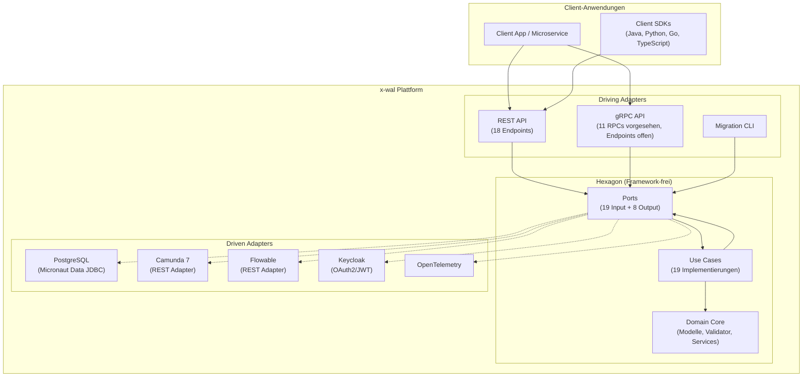
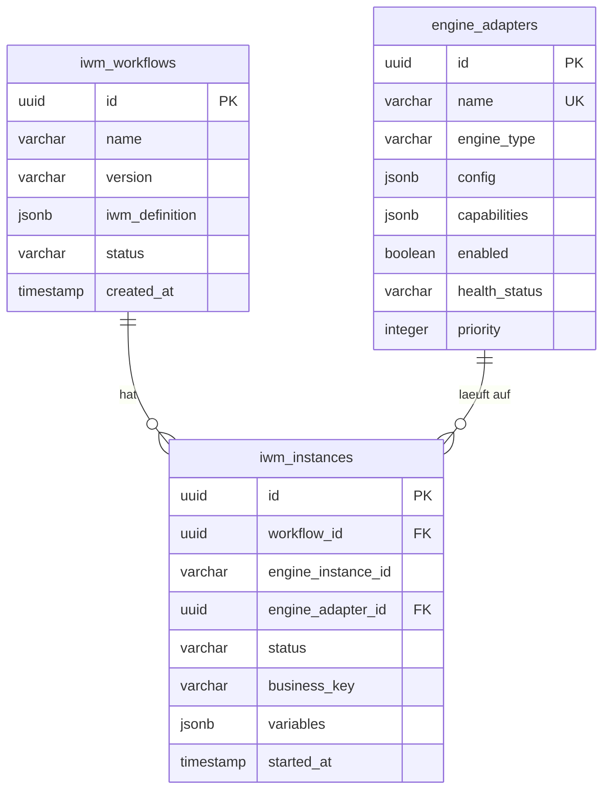

# x-wal Architektur-Uebersicht

**Version:** 2.0.0
**Architektur:** Hexagonal (Ports & Adapters)
**Stand:** 10. April 2026

### API-Umsetzungsstand

- REST: vollständig dokumentiert und implementiert (18 Endpoints).
- gRPC: Protobuf ist vorhanden, Endpoint-Implementierung in `adapters/driving/web` ist noch offen.
- OpenAPI/Swagger: Dokumentation noch als offener Punkt (noch nicht end-to-end produktiv geschaltet).
- Security: aktuelle Scopes sind `workflow.read`, `workflow.write`, `workflow.admin`.

---

## System-Ueberblick

x-wal (Cross-Workflow Abstraction Layer) abstrahiert verschiedene Workflow-Engines hinter einer einheitlichen API. Die Architektur folgt dem hexagonalen Muster (Ports & Adapters), bei dem der Domain-Kern framework-frei ist.



---

## Hexagonale Modulstruktur

```
x-wal/
├── hexagon/                          # KEIN Framework (pure Kotlin)
│   ├── core/                         # Domain-Kern
│   ├── ports/                        # Port-Interfaces
│   └── application/                  # Use Cases
├── adapters/
│   ├── driving/                      # Primaere Adapter (rufen Hexagon auf)
│   │   ├── web/                      # REST + gRPC (gRPC noch offen)
│   │   └── cli/                      # Migration-Tool
│   └── driven/                       # Sekundaere Adapter (vom Hexagon gerufen)
│       ├── persistence/              # PostgreSQL
│       ├── engine/                   # Camunda 7, Flowable
│       ├── identity/                 # Keycloak
│       └── observability/            # OpenTelemetry
└── app/                              # Composition Root
```

### Abhaengigkeitsrichtung

```
hexagon/core       <-- haengt von NICHTS ab
hexagon/ports      --> hexagon/core
hexagon/application --> hexagon/ports, hexagon/core

adapters/driving/*  --> hexagon/ports  (NICHT hexagon/application)
adapters/driven/*   --> hexagon/ports, hexagon/core

app                 --> ALLE Module (Composition Root)
```

**Regeln (durch Architektur-Tests verifiziert):**
- Kein Hexagon-Modul importiert ein Adapter-Modul oder Framework
- Kein Adapter-Modul importiert ein anderes Adapter-Modul
- Controller injizieren Port-Interfaces, nicht Implementierungen
- Bean-Wiring erfolgt ausschliesslich im `app`-Modul via `@Factory`

---

## Modul-Details

### hexagon/core — Domain-Kern

Reines Kotlin. Keine Micronaut-Dependencies.

| Bereich | Inhalt |
|---|---|
| **Modelle** | Workflow, WorkflowInstance, EngineAdapterConfig, Task, TaskFilter, AdapterCapabilities, EngineInstanceStatus, HistoricInstanceInfo, Incident |
| **Value Objects** | WorkflowId, InstanceId, EngineAdapterId, IwmDefinition, TaskId (composite: ENGINE_TYPE:id) |
| **Enums** | WorkflowStatus, InstanceStatus, EngineType, HealthStatus, TaskStatus, IncidentType |
| **Validierung** | IwmValidator (JSON Schema v0.2), ValidationResult |
| **Services** | IwmValidationService, EngineRoutingLogic, TaskAggregationLogic, HistoryResolutionLogic |
| **Exceptions** | DomainException (sealed class) mit 8 Subtypen |

### hexagon/ports — Port-Interfaces

| Typ | Ports | Beispiele |
|---|---|---|
| **Input (19)** | Use-Case-Interfaces | CreateWorkflowUseCase, StartWorkflowUseCase, QueryTasksUseCase, CompleteTaskUseCase, HealthCheckAdapterUseCase, SyncInstanceStateUseCase |
| **Output (8)** | Repository/Adapter-Interfaces | WorkflowRepository, InstanceRepository, WorkflowEnginePort, AdapterInstanceCachePort, TransactionPort, DistributedLockPort |

### hexagon/application — Use Cases

19 Implementierungen der Input Ports. Orchestrieren Domain-Services und Output-Ports.

| Gruppe | Use Cases |
|---|---|
| **Workflow** | Create, Get, List, Update, Delete, Start, Suspend, Resume, Cancel, GetInstance, GetInstanceVariables |
| **Task** | Query, Complete, Assign, Get |
| **Adapter** | Register, Deregister, HealthCheck |
| **Sync** | SyncInstanceState |

Shared: `AdapterResolutionService` — Cache-first Adapter-Aufloesung mit Null-Safety.

### adapters/driving/web — REST + gRPC (gRPC noch offen)

| Controller | Endpoints | Scopes |
|---|---|---|
| WorkflowController | 8 (CRUD, Start, Suspend, Resume, Cancel) | workflow.read, workflow.write, workflow.admin |
| InstanceController | 2 (Get, GetVariables) | workflow.read |
| TaskController | 5 (Query, Complete, Get, Assign, Unassign) | workflow.read, workflow.write |
| AdapterController | 4 (Register, Deregister, HealthCheck, HealthCheckAll) | workflow.admin |

Infrastruktur: GlobalExceptionHandler (RFC 7807), ApiVersionResponseFilter (X-XWAL-Version: 2.0.0).

### adapters/driven/persistence — PostgreSQL

| Entity | Tabelle | Besonderheiten |
|---|---|---|
| WorkflowEntity | iwm_workflows | JSONB fuer IWM-Definition |
| InstanceEntity | iwm_instances | JSONB fuer Variablen, nullable engine_instance_id (Saga) |
| EngineAdapterEntity | engine_adapters | JSONB fuer Config + Capabilities |

3 Flyway-Migrationen (V1: Schema, V2: Sync-Index, V3: Hexagonal-Fixes).
Repository-Adapter implementieren Domain-Ports, Entity-Mapper trennen Domain von Persistenz.
MicronautTransactionAdapter implementiert TransactionPort.

### adapters/driven/engine — Workflow-Engines

| Adapter | Engine | Protokoll | LOC |
|---|---|---|---|
| Camunda7Adapter | Camunda 7.24.0 | REST | ~650 |
| FlowableAdapter | Flowable 7.0.0 | REST | ~600 |

Shared: EngineAdapterFactoryImpl, InMemoryAdapterCache, BpmnToIwmTransformer.
IWM-BPMN Transformer pro Engine mit Layout-Support (BPMN DI).
Resilience: Resilience4j (Circuit Breaker, Retry) via AdapterResilientDecorator.

### adapters/driven/identity — Keycloak

- SecurityConfiguration: JWT Claims Validator (Issuer-Suffix-Check)
- KeycloakRolesMapper: Realm/Client-Rollen → x-wal Scopes

### adapters/driven/observability — OpenTelemetry

- ObservabilityConfiguration: Tracer + Meter Bean-Factory

### app — Composition Root

- Application.kt: Micronaut Entry Point
- 4 Factory-Klassen: registrieren alle 19 Use Cases + 2 Domain-Services als @Singleton Beans
- InstanceStateSyncScheduler: periodische Instanz-Synchronisation
- application.yml: Security, Datasource, Flyway, OTel, Caching, Custom Config

---

## Datenmodell



---

## Security-Architektur

```
Client → JWT Token (Keycloak) → x-wal API
                                    │
                          SecurityConfiguration
                          (Issuer + Subject Validation)
                                    │
                          KeycloakRolesMapper
                          (Keycloak Rollen → x-wal Scopes)
                                    │
                          @Secured Annotations
                          (workflow.read, workflow.write, workflow.admin)
```

3 Scopes: `workflow.read`, `workflow.write`, `workflow.admin`
4 Rollen: `admin`, `workflow-designer`, `workflow-executor`, `viewer`

---

## Technologie-Stack

| Komponente | Technologie | Version |
|---|---|---|
| Sprache | Kotlin (JVM) | 2.3.20 |
| Framework | Micronaut | 4.9.4 |
| Build | Gradle (KTS) + Version Catalog | 8.5 |
| Annotation Processing | KSP | 2.3.6 |
| Datenbank | PostgreSQL | 16 |
| Migration | Flyway | via Micronaut |
| Security | Keycloak (OAuth2/JWT) | 23.0 |
| Observability | OpenTelemetry | 1.32.0 |
| Resilience | Resilience4j | 2.1.0 |
| Workflow Engines | Camunda 7 / Flowable | 7.24.0 / 7.0.0 |
| Tests | JUnit 5, MockK, Testcontainers | 5.10.1 / 1.13.9 / 1.21.4 |
| CLI | Picocli | 4.7.5 |
| Container | Docker (Alpine JRE 21) | Multi-Stage |
| CI/CD | GitHub Actions | 4 Workflows |
