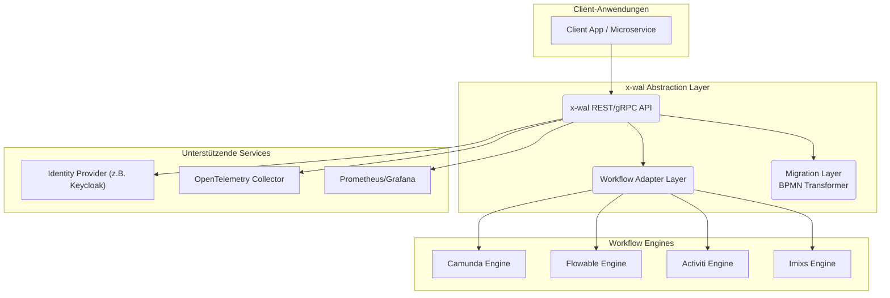

# Lastenheft – Projekt x-wal

## BPMN Workflow Engine Abstraction Layer

**x-WAL (Workflow Abstraction Layer) ist ein technologieunabhängiger Abstraktionslayer, der eine einheitliche API für verschiedene Workflow-Engines bereitstellt.
Er ermöglicht engineübergreifende Migrationen, Analysen und Generierungen, um Vendor-Lock-in zu vermeiden und Workflows plattformübergreifend portabel zu machen.**

### Version 2.0.0 – Stand: 10. April 2026

### API-Umsetzungsstand

- REST: Kern-API vollständig dokumentiert und implementiert (18 Kern-Endpunkte).
- gRPC: Protobuf ist vorhanden, Endpoint-Implementierung in `adapters/driving/web` ist noch offen.
- OpenAPI/Swagger: Spezifikation und UI sind noch offen und werden als Folgeaufgabe geführt.
- Security: aktive Scopes sind `workflow.read`, `workflow.write`, `workflow.admin`.

---

## 1. Zielbestimmung

### 1.1 Ziel des Projekts

Das Projekt **x-wal (Workflow Abstraction Layer)** verfolgt das Ziel, eine **einheitliche, technologieunabhängige Schnittstelle** für verschiedene **Workflow-Engines** bereitzustellen. Ein Hauptaugenmerk liegt dabei auf der **Vermeidung eines Vendor-Lock-ins**, um langfristige Flexibilität und Unabhängigkeit zu gewährleisten. Dadurch sollen bestehende und neue Applikationen Workflows **unabhängig von der konkreten Engine-Implementierung** ausführen, verwalten und überwachen können.

### 1.2 Motivation

Der Markt bietet mehrere etablierte BPMN-Engines (Camunda, Flowable, Activiti, Imixs) und Code-First-Engines(Temporal, Netflix Conductor). Diese unterscheiden sich in API-Design, Deployment-Modellen und Funktionsumfang. Unternehmen, die Microservices-Architekturen betreiben, benötigen eine **standardisierte Abstraktionsschicht**, um:

* Vendor-Lock-in zu vermeiden,
* Migrationen und Upgrades zu erleichtern,
* und eine konsistente Observability (OpenTelemetry) zu gewährleisten.

### 1.3 Projektziele

* **Vermeidung von Vendor-Lock-in:** Die Architektur muss den Austausch von Workflow-Engines ohne wesentliche Änderungen an der Geschäftslogik ermöglichen.
* Einheitliches API-Interface zur Ausführung, Verwaltung und Überwachung von BPMN-Workflows.
* Austauschbare Engine-Adapter für Camunda, Flowable, Activiti und Imixs.
* Integration in bestehende Unternehmens-Microservices via REST/gRPC-API.
* Unterstützung eines Migrationskonzepts zwischen unterschiedlichen Workflow-Providern durch Tools.
* Verwendung des External-Task-Patterns zur Entkopplung von Orchestrierung und Ausführung.
* Unterstützung von OpenTelemetry für verteiltes Tracing und Metriken.
* Authentifizierung und Autorisierung über Keycloak (OAuth2/OpenID Connect).
* Bereitstellung einer DevContainer-basierten Entwicklungsumgebung.
* Steigerung der Benutzerakzeptanz durch transparente Erweiterbarkeit und begleitende Entwicklerwerkzeuge (IWM-SDK, Migrationsassistenten).

---

## 2. Ist-Analyse

| Aspekt               | Aktueller Zustand                                                     |
| -------------------- | --------------------------------------------------------------------- |
| Workflow Engines     | Unterschiedliche APIs und Deployment-Modelle (Camunda, Flowable etc.) |
| Integration          | Jedes Projekt nutzt eigene REST- oder Java-APIs                       |
| Monitoring           | Keine einheitliche Metrik- oder Logging-Schnittstelle                 |
| Authentifizierung    | Unterschiedliche Implementierungen, teilweise manuell integriert      |
| DevOps               | Keine standardisierte Entwicklungs- oder Testumgebung                 |
| Wiederverwendbarkeit | Gering, da Engine-spezifische Implementierungen erforderlich sind     |
| Migration            | Workflow-Modelle enthalten Engine-spezifische Erweiterungen           |

---

## 3. Zielsystem

### 3.1 Systemübersicht

Das Zielsystem besteht aus:

* **Core-Modul:** Definiert das generische Workflow-API und gemeinsame Domänenmodelle.
* **Engine-Adapter:** Plug-in-basierte Implementierungen für Camunda, Flowable, Activiti, Imixs.
* **Integration-Layer:** REST/gRPC-Gateway mit Authentifizierung (Keycloak).
* **Observability-Layer:** OpenTelemetry-basierte Metrik-, Logging- und Tracing-Integration.
* **Migration-Layer:** Transformation und Mapping von Workflow-Modellen zwischen Engines.
* **DevContainer-Setup:** Automatisierte Entwicklungsumgebung mit allen Abhängigkeiten.

### 3.2 Systemkontextdiagramm

### 3.3 Intermediate Workflow Model (IWM)

Das **Intermediate Workflow Model (IWM)** fungiert als kanonisches Domänenmodell innerhalb von x-wal und kapselt alle Engine-spezifischen Workflows, Tasks und Übergänge in einer normalisierten Repräsentation.  
Es stellt folgende Kernaufgaben bereit:

* **Canonical Data Layer:** Gemeinsame Datengrundlage für Engine-Adapter, Migration-Layer und Analysefunktionen.  
* **Schema-Governance:** Pflege und Versionierung des JSON-Schemas (`hexagon/core/src/main/resources/schema/iwm.schema.json` ), inklusive Validierungsroutinen und Kompatibilitätscheck.  
* **Erweiterbarkeit:** Aufnahme von Enginespezifika über optionale Erweiterungsbereiche (z.B. BPMN-Lane-Assignments, Policies), ohne das generische Modell zu verletzen.  
* **Analyse & Migration:** Grundlage für Migrationsreports, KI-gestützte Transformationen und automatisierte Findings (`analysis`-Sektion des Schemas).
* **Extensions-Namespace:** Konfigurierbarer Container für proprietäre Metadaten (Workflow-/Task-/Edge-Ebene), der Migrationen ohne Informationsverlust ermöglicht.
* **Meta-Daten:** Separater `meta`-Container für technische Informationen (Importquelle, Tool-Versionen, Audit), um fachliche Inhalte von Operationalia zu trennen.
* **Layout-Views:** Optionaler `layouts`-Bereich, der Diagramm-Koordinaten (Nodes, Kanten, Waypoints) pro Engine/Editor speichert, sodass Migrationen das visuelle Modell (z.B. Camunda 7 → Camunda 8) erhalten können.

Alle Adapter und Werkzeuge müssen das IWM als internen Austausch- und Persistenzstandard verwenden.

---

## 4. Anforderungen

### 4.1 Anwendungsfälle (Use Cases)

**Use Case 1: Urlaubsantrag**

1.  **Akteur:** Mitarbeiter (Client-Anwendung)
2.  **Szenario:** Ein Mitarbeiter stellt einen Urlaubsantrag über eine Web-Anwendung.
3.  **Ablauf:**
    * Die Client-Anwendung sendet eine `POST`-Anfrage an den `/api/v1/workflows/{id}/start`-Endpunkt der x-wal API mit der Prozess-ID `urlaubsantrag` und den Prozessvariablen (Mitarbeiter-ID, Startdatum, Enddatum).
    * x-wal startet die Workflow-Instanz in der konfigurierten Engine (z.B. Flowable).
    * Ein User-Task "Antrag genehmigen" wird für den zuständigen Vorgesetzten erstellt.
    * Die Vorgesetzten-Anwendung fragt regelmäßig über den `/tasks`-Endpunkt die offenen Aufgaben ab und zeigt sie an.
    * Der Vorgesetzte genehmigt den Antrag. Die Anwendung sendet eine `POST`-Anfrage an `/tasks/{taskId}/complete` mit der Entscheidung "genehmigt".
    * Der Prozess wird fortgesetzt, ein Service-Task informiert die Personalabteilung via REST-Call.
    * Der Prozess wird erfolgreich beendet.

### 4.2 Funktionale Anforderungen (Muss)

| Nr.  | Kategorie      | Beschreibung                                                                                                                                                                                  |
| ---- | -------------- | --------------------------------------------------------------------------------------------------------------------------------------------------------------------------------------------- |
| M-01 | Funktional     | Einheitliches Workflow-API (Start, Stop, Query, Task-Management).                                                                                                                             |
| M-02 | Funktional     | Engine-Adapter für Camunda (Mind. 7.x) und Flowable; Erweiterbarkeit für weitere Engines (8.x/Zeebe, Activiti, Imixs) ist vorgesehen.                                                                                                                    |
| M-03 | Funktional     | Automatische Auswahl der Engine anhand Konfiguration.                                                                                                                                         |
| M-04 | Funktional     | Persistenz-Abstraktion für Workflow-Instanzen.                                                                                                                                                |
| M-05 | Schnittstellen | Bereitstellung als REST-API (OpenAPI 3) und optional gRPC.                                                                                                                                    |
| M-06 | Sicherheit     | Authentifizierung und Autorisierung mittels des Standards OAuth2/OpenID Connect. Die Implementierung muss gegen den unternehmensweiten Identity Provider (aktuell Keycloak) validiert werden. |
| M-07 | Monitoring     | OpenTelemetry-basierte Tracing- und Logging-Integration.                                                                                                                                      |
| M-08 | DevOps         | Bereitstellung von Docker-Compose und DevContainer-Konfiguration.                                                                                                                             |
| M-09 | Qualität       | 90 % Test-Coverage für Core-Module, 80 % für Adapter.                                                                                                                                         |
| M-10 | Portabilität   | Laufbar auf Linux/Container-basierten Umgebungen.                                                                                                                                             |
| M-11 | Funktional     | Unterstützung für engineübergreifende Modelltransformationen.                                                                                                                                 |
| M-12 | Funktional     | Intermediate Workflow Model (IWM) v0.2 als kanonisches Domänenmodell implementieren, versionieren und gegen das JSON-Schema (inkl. Extensions- und Meta-Namespace) automatisiert validieren.  |

### 4.3 Funktionale Anforderungen (Soll)

| Nr.  | Kategorie   | Beschreibung                                                                                                                                                                                                                              |
| ---- | ----------- | ----------------------------------------------------------------------------------------------------------------------------------------------------------------------------------------------------------------------------------------- |
| S-01 | Funktional  | Parser für Temporal-Workflows (`workflow.ts`) zur Abbildung in das IWM, inklusive Auswertung des TypeScript-AST bzw. generierter JSON-Repräsentationen.                                                                                   |
| S-02 | Funktional  | Parser für Argo Workflows YAML, um Kubernetes-native Orchestrierungen in das IWM zu überführen.                                                                                                                                          |
| S-03 | Funktional  | Erweiterter Parser für Zeebe/Camunda-8-spezifische JSON- und BPMN-Erweiterungen, um Unterschiede zur klassischen Camunda-7-BPMN-Interpretation abzudecken.                                                                               |
| S-04 | Funktional  | Parser für AWS Step Functions State Machine JSON zur Migration von Cloud-nativen Workflows in das IWM.                                                                                                                                   |
| S-05 | Funktional  | Parser für Prefect-2.x-Flows auf Basis der Python-DSL (AST-Analyse), um dataflow-orientierte Workflows in das IWM zu übertragen.                                                                                                          |
| S-06 | Funktional  | KI-gestützter Generik-Parser zur Abbildung proprietärer Workflow-Formate in das IWM inklusive Evaluierung der Ergebnisqualität (Precision/Recall) und optionaler manueller Review-Schleifen.                                             |
| S-07 | Integration | Bereitstellung eines IWM-SDK (Parser- und Generator-Schnittstellen, Templates, Utilities), damit Kunden eigene Engine-Adapter, Konverter und Exporte konsistent gegen das IWM entwickeln können.                                          |

### 4.4 Funktionale Anforderungen (Kann)

| Nr.  | Kategorie   | Beschreibung                                                                                                                                                                                                                                                                                                                                                                                                               |
| ---- | ----------- | -------------------------------------------------------------------------------------------------------------------------------------------------------------------------------------------------------------------------------------------------------------------------------------------------------------------------------------------------------------------------------------------------------------------------- |
| K-01 | Funktional  | Unterstützung für BPMN-Erweiterungen (DMN, CMMN).                                                                                                                                                                                                                                                                                                                                                                          |
| K-02 | Integration | Native Integration mit Micronaut-EventBus.                                                                                                                                                                                                                                                                                                                                                                                 |
| K-03 | Monitoring  | Integration mit Grafana Tempo / Loki.                                                                                                                                                                                                                                                                                                                                                                                      |
| K-04 | DevOps      | Bereitstellung einer Replay-/Incident-Pipeline für Workflow-Fehler.                                                                                                                                                                                                                                                                                                                                                        |
| K-05 | Funktional  | Unterstützung für partielle Laufzeitmigration laufender Instanzen.                                                                                                                                                                                                                                                                                                                                                         |
| K-06 | Migration   | Evaluierung und optionaler Einsatz von KI-Modellen (z.B. LLMs) zur Transformation von **BPMN-Modellen und proprietären Workflow-Formaten** in ein **abstraktes, textbasiertes Zwischenformat (z.B. Markdown)**. Dieses Format soll sowohl als lesbare Spezifikation dienen als auch die **Wiederherstellung des Workflows für eine andere Ziel-Engine ermöglichen**, um die Unabhängigkeit vom Anbieter weiter zu erhöhen. |
| K-07 | Integration | Bereitstellung von dedizierten Client-SDKs (Software Development Kits) für gängige Programmiersprachen (z.B. Java/Kotlin, Python, Go, TypeScript/JavaScript), um die Integration mit der x-wal API zu vereinfachen.                                                                                                                                                                                                        |

---

## 5. Abgrenzung (Out of Scope)

Folgende Funktionalitäten sind explizit **nicht** Teil dieses Projekts:

* **Grafische Oberflächen:** Es wird keine Benutzeroberfläche zur Prozessmodellierung, Task-Verwaltung oder Administration bereitgestellt. x-wal ist ein reiner Backend-Service.
* **Revisionssichere Archivierung:** Die langfristige und revisionssichere Speicherung abgeschlossener Workflow-Instanzen liegt in der Verantwortung der nutzenden Systeme.
* **Identitätsmanagement:** Benutzer- und Gruppenverwaltung ist nicht enthalten. Diese wird ausschließlich über den angebundenen Keycloak-Server realisiert.

---

## 6. Migrationskonzept

### 6.1 Motivation
BPMN-Modelle enthalten Engine-spezifische Erweiterungen, die zu Inkompatibilitäten zwischen Engines führen.  
Ein Migrationskonzept ermöglicht:
- Austausch von Engines ohne manuelle Anpassung aller Modelle.  
- vereinfachte Updates, Proof-of-Concepts und parallele Testumgebungen.  

### 6.2 Ebenen der Migration
1. **Modell-Transformation (Static Migration)**  
   - Automatische Konvertierung von BPMN-XML-Dateien zwischen Engine-spezifischen Formaten.  
   - Mapping von Namespaces, Attributen und ServiceTask-Typen.  
   - Realisierung über XML-Parser oder XSLT-Mappings.  

2. **Laufzeit-Migration (Runtime Migration)**  
   - Export und Reimport von Instanzdaten, Prozessvariablen und Status-Informationen.  
   - Nur für bestimmte Prozesszustände (z. B. beendet, fehlerhaft, suspendiert).  
   - Halbautomatische Unterstützung, manuelle Validierung notwendig.  

3. **API-Abstraktion (Runtime Independence)**  
   - x-wal bietet ein konsistentes API für Start, Query, Task-Handling, unabhängig von der Engine.  
   - Ermöglicht Austausch von Engines ohne Anpassung im aufrufenden Service.  

### 6.3 Artefakte
- `mappings/<source>_to_<target>.yml` – Mapping-Regeln für Engine-Transformation.  
- `migration-tool.jar` – eigenständiges CLI zur statischen BPMN-Transformation.  
- `MigrationReport.md` – automatischer Bericht über Transformationsergebnisse.  
- `iwm-sdk/` – Referenzimplementierung mit Parser- und Generator-Schnittstellen inkl. Tests, Utilities und Dokumentation.

### 6.4 Risiken
- Proprietäre Erweiterungen können semantisch inkompatibel sein.  
- Unterschiedliche Tasktypen (z. B. ExternalTask vs. ServiceTask).  
- Unterschiedliche Deployment-Strategien (z. B. gRPC vs. REST).  

### 6.5 Erfolgskriterien
- Modell-Transformation funktioniert für mindestens 80 % der Standard-Workflows.
- API-Kompatibilität ohne Codeanpassung der Clients.
- Validierte Instanzmigration zwischen mindestens zwei Engines.

---

## 7. Nicht-funktionale Anforderungen

| Merkmal             | Zielgröße                                                                                                       | Messkriterium                                        |
| ------------------- | --------------------------------------------------------------------------------------------------------------- | ---------------------------------------------------- |
| **Zuverlässigkeit** | ≥ 99,5 % Verfügbarkeit                                                                                          | Uptime-Monitoring über 30 Tage                       |
| **Performance**     | 95. Perzentil der Antwortzeiten unter Last (100 req/s): - Workflow-Start: < 500 ms - Task-Query: < 300 ms | Load-Test mit k6/JMeter                              |
| **Skalierbarkeit**  | Horizontal skalierbar, um 10.000 Workflow-Starts pro Stunde auf 3 Instanzen zu verarbeiten.                     | Skalierungstest im Kubernetes-Cluster                |
| **Sicherheit**      | OAuth2/OIDC-konform, TLS 1.3 für alle externen Verbindungen                                                     | Penetration-Test, Code-Analyse mit SAST-Tools        |
| **Wartbarkeit**     | Modul-basiertes Design, dokumentierte Plug-in-Schnittstellen                                                    | Code-Review, statische Code-Analyse (z.B. SonarQube) |
| **Datenvolumen**    | Verwaltung von bis zu 1 Mio. aktiven und 10 Mio. abgeschlossenen Instanzen pro Jahr.                            | Benchmark der Persistenzschicht                      |

---

## 8. Betriebskonzept

* **Deployment:** Die Anwendung wird als Docker-Container bereitgestellt und ist für den Betrieb in einer Container-Orchestrierungsumgebung wie Kubernetes optimiert. Ein Helm-Chart wird zur Verfügung gestellt.
* **Konfiguration:** Die Konfiguration (Datenbank-Verbindungen, Engine-Wahl, Keycloak-URLs) erfolgt über Environment-Variablen oder Kubernetes ConfigMaps/Secrets.
* **Monitoring:** Metriken werden im Prometheus-Format über einen `/metrics`-Endpunkt bereitgestellt. Logs werden als strukturierte JSON-Logs auf `stdout` ausgegeben. Traces werden an einen OpenTelemetry-Collector gesendet.

---

## 9. Risikobetrachtung

| Risiko                              | Eintrittswahrscheinlichkeit | Auswirkung | Gegenmaßnahme                                                                                                                                                                           |
| ----------------------------------- | --------------------------- | ---------- | --------------------------------------------------------------------------------------------------------------------------------------------------------------------------------------- |
| **Technische Inkompatibilität**     | Mittel                      | Hoch       | Frühzeitige Proof-of-Concepts für alle Ziel-Engines; Fokus auf Standard-BPMN-Konstrukte; klares Reporting.                                                                              |
| **Architekturunterschiede Camunda** | Hoch                        | Hoch       | Camunda 7.x (REST-basiert) und 8.x/Zeebe (gRPC/Event-Streaming) haben fundamental unterschiedliche Architekturen. Separate Adapter mit klarer Abgrenzung der Capabilities erforderlich. |
| **Performance-Overhead**            | Gering                      | Mittel     | Kontinuierliche Performance-Tests im CI/CD-Prozess; Caching-Strategien evaluieren.                                                                                                      |
| **Abhängigkeit von Drittsystemen**  | Hoch                        | Mittel     | Stabile, versionierte APIs verwenden; resilienter Code (Timeouts, Retries, Circuit Breaker).                                                                                            |
| **Komplexität der Adapter**         | Mittel                      | Mittel     | Klare Schnittstellendefinition (Interface); gute Dokumentation und Testabdeckung für jeden Adapter.                                                                                     |

---

## 10. Entwicklungsumgebung und Werkzeuge

* Kotlin 2.3.20 / JDK 21
* Micronaut 4.9.4 (Backend)
* Hexagonale Architektur (Ports & Adapters)
* Gradle 8.5 (KTS) mit Version Catalog
* Docker + DevContainer
* OpenTelemetry SDK 1.32.0 + Collector
* Keycloak 23+
* GitHub Actions (CI, Tests, Docker, Docs)
* BPMN-Engines: Camunda 7.24.0 (REST-basiert), Flowable 7.0.0 (REST-basiert), Camunda 8.x/Zeebe (geplant)

---

## 11. Dokumentation

* API-Dokumentation (OpenAPI/Swagger, gRPC-Protos)
* Architekturübersicht (C4-Model Level 1–3)
* Developer-Guide: Engine-Adapter-Implementierung
* Migrationshandbuch: Modell-Transformation und Engine-Wechsel
* IWM-SDK-Guide: Nutzung der Parser- und Generator-Schnittstellen inkl. Qualitätskriterien, Test-Setup und Best Practices
* Betriebsdokumentation (Deployment, Monitoring, Security)

---

## 12. Abnahmekriterien

* Alle Muss-Anforderungen (M-01 bis M-12) sind erfüllt und durch Tests abgedeckt.
* IWM-Artefakte validieren erfolgreich gegen das veröffentlichte JSON-Schema (Version ≥ 0.2) im automatisierten Build.
* Der Anwendungsfall "Urlaubsantrag" ist End-to-End mit zwei verschiedenen Engines (z.B. Flowable und Camunda) erfolgreich testbar.
* Das Migrations-Tool generiert erfolgreiche Mapping-Reports für bereitgestellte Beispiel-Workflows.
* Ein verteiltes Trace ist in Jaeger/Grafana Tempo sichtbar.
* API-Zugriff ohne valides Keycloak-Token wird mit HTTP 401/403 abgewiesen.

---

## 13. Anhänge

* Glossar (BPMN, DMN, Task, Instance, Adapter etc.)
* Referenzen: OMG BPMN 2.0 Standard, Camunda Docs, Flowable Docs, etc.

---

© 2026 x-wal Project Team – Version 2.0.0
