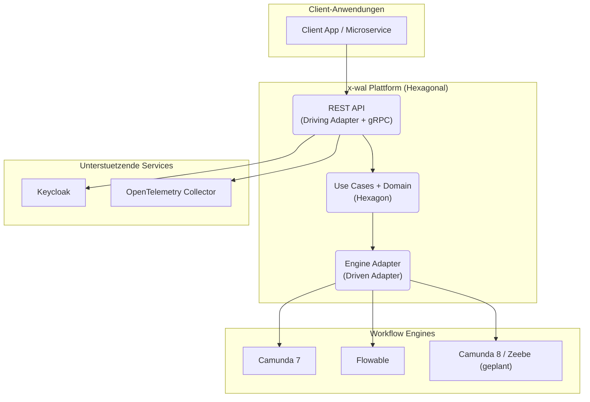

# Pflichtenheft – Projekt x-wal

## BPMN Workflow Engine Abstraction Layer

### Version 2.0.0 – Stand: 10. April 2026

**Implementierungsstand:** Hexagonale Architektur vollstaendig umgesetzt. 10 von 12 Muss-Anforderungen implementiert (2 Teilziele).

### API-Umsetzungsstand

- REST: vollständig dokumentiert und implementiert (18 Endpoints).
- gRPC: Protobuf ist vorhanden und Endpoint-Implementierung in `adapters/driving/web` ist implementiert.
- OpenAPI/Swagger: Spezifikation und UI sind konfiguriert und bereitgestellt.
- Security: aktive Scopes sind `workflow.read`, `workflow.write`, `workflow.admin`.

---

## 1. Einleitung

### 1.1 Zweck des Dokuments
Dieses Pflichtenheft konkretisiert die technischen Umsetzungen fuer das im Lastenheft-x-wal-v2.0.0 beschriebene System. Es uebersetzt die Anforderungen (Muss M-01 bis M-12, Soll S-01 bis S-07, Kann K-01 bis K-07) in verbindliche Implementierungs- und Nachweisplaene.

### 1.2 Geltungsbereich
Version 2.0.0 des x-WAL. Gegenueber v1 wurde die Architektur von Layered (Java) auf Hexagonal (Kotlin) migriert. Backend-Services, Migrationstools, Entwickler-Werkzeuge sowie Dokumentation und Betrieb. UI-Themen sind ausgenommen (s. Lastenheft Abschnitt 5).

Das Projekt ist als technologieunabhaengiger Workflow-Abstraktionslayer konzipiert, mit Fokus auf:

- Vereinheitlichte Workflowschnittstelle fuer Start, Query und Task-Management.
- Reduktion von Vendor-Lock-in durch engineaenderbarkeit.
- Engine-uebergreifende Portierung (Statische Migration) und gemeinsame Domänenabstraktion.

### 1.3 Referenzen
- Lastenheft-x-wal-v2.0.0.md
- Architecture.md (Hexagonale Architektur)
- hexagonal-migration.md (Migrationsplan v1 → v2)
- iwm.schema.json (Intermediate Workflow Model v0.2)

### 1.4 Definitionen
- **IWM:** Intermediate Workflow Model (kanonisches JSON-Datenmodell)
- **Hexagon:** Domain-Kern (core + ports + application), framework-frei
- **Driving Adapter:** Primaerer Adapter (REST + gRPC) — ruft Use Cases auf
- **Driven Adapter:** Sekundaerer Adapter (DB, Engine, Identity) — wird von Use Cases gerufen
- **Port:** Interface im Domain-Kern (Input Port = Use Case, Output Port = Repository/Adapter)
- **Out-of-Scope:** Keine UI-Funktionen, keine revisionssichere Langzeitarchivierung, kein eigenes Identity-Management.

---

## 2. Produktuebersicht

### 2.1 Systemkontext

Aus fachlicher Sicht ist das Zielbild:

- einheitliche API fuer bestehende und neue Services,
- wiederverwendbare Adapter je Engine,
- zentrale Modellisierung via IWM inkl. Erweiterungsbereichen (`extensions`, `meta`, `layouts`),
- konsistente Observability im OpenTelemetry-Stack.

### 2.2 Architektur

Hexagonale Architektur (Ports & Adapters) mit 10 Gradle-Modulen. Details: [Architecture.md](Architecture.md).

---

## 3. Funktionsspezifikation

### 3.1 Muss-Anforderungen

| ID | Status | Umsetzung | Nachweis |
|---|---|---|---|
| **M-01** | Done | 18 REST Endpoints: WorkflowController (8), InstanceController (2), TaskController (5), AdapterController (4). gRPC: workflow.proto (11 RPCs definiert) mit Endpoint-Implementierung in `adapters/driving/web`. | Controller + gRPC-Endpunkte kompilieren |
| **M-02** | Done | Camunda7Adapter + FlowableAdapter (jeweils REST-basiert). WorkflowEnginePort Interface. IWM-BPMN Transformer pro Engine. Factory + Cache + Resilience. | 7 Engine-Adapter-Tests |
| **M-03** | Done | EngineRoutingLogic: Prioritaet, Health-Status, Target-Engine-Hint aus IWM. AdapterResolutionService: Cache-first mit Null-Safety. | 6 Routing-Tests |
| **M-04** | Done | PostgreSQL 16, Flyway (3 Migrationen), 3 Repository-Adapter (WorkflowRepositoryAdapter, InstanceRepositoryAdapter, AdapterConfigRepositoryAdapter). Entity-Mapper trennen Domain von Persistenz. TransactionPort. | 5 Persistence-Integration-Tests (Testcontainers) |
| **M-05** | Done | REST: 18 Endpoints mit OpenAPI-Annotationen. OpenAPI/Swagger konfiguriert. gRPC: workflow.proto + vollständige Endpoint-Implementierung (`WorkflowServiceEndpoint`, `TaskServiceEndpoint`). | OpenAPI/Swagger-Config + kompilierte gRPC-Endpunkte |
| **M-06** | Done | SecurityConfiguration (JWT Issuer-Validation), KeycloakRolesMapper (Realm/Client-Rollen → 4 Scopes). @Secured auf allen Endpoints. | Keycloak Realm-Config |
| **M-07** | Teilweise | ObservabilityConfiguration (Tracer/Meter Beans), JSON Structured Logging (Logback + Logstash Encoder), Use-Case-Decorators für zentrale Use-Cases (Tracing/Metrics) teils umgesetzt. | Kern-Use-Cases validiert |
| **M-08** | Done | docker-compose.dev.yml (6 Services), .devcontainer/ (JDK 21 + Kotlin CLI), Dockerfile (Multi-Stage, Alpine). | Dateien vorhanden |
| **M-09** | Teilweise | 77 Tests (Domain 38, Use Case 14, Persistence 5, Engine 7, Architektur 13). JaCoCo-Reports und Coverage-Verifikation per Gradle-Konfiguration vorhanden; Ziel 80% ist noch explizit zu verifizieren. | `./gradlew test` gruen |
| **M-10** | Done | Multi-Stage Dockerfile, eclipse-temurin:21-jre-alpine, Health Check. | Dockerfile vorhanden |
| **M-11** | Done | CLI Migration-Tool (Picocli): IWM JSON ↔ BPMN XML bidirektional. BpmnToIwmTransformer + IwmToBpmnTransformer (Camunda7, Flowable). | CLI kompiliert |
| **M-12** | Done | IwmValidator (JSON Schema v0.2, Draft-2020-12), ValidationResult. Schema in hexagon/core/resources/. Pre-Validation fuer required fields. | 6 Validator-Tests |

### 3.2 Soll-Anforderungen

| ID | Status | Planung |
|---|---|---|
| S-01 | Offen | Temporal Parser: Post-MVP |
| S-02 | Offen | Argo Parser: Post-MVP |
| S-03 | Offen | Zeebe/Camunda 8 Adapter: naechster Sprint |
| S-04 | Offen | AWS Step Functions: Post-MVP |
| S-05 | Offen | Prefect 2.x: Post-MVP |
| S-06 | Offen | KI-Parser: Post-MVP (Prompt-Templates, z. B. `prompts/ai_parse.md`, konfigurierbarer LLM-Connector, Quality Gate: Precision >= 0.75, Recall >= 0.70; optionaler manueller Review-Flow) |
| S-07 | Offen | IWM-SDK: Post-MVP |

### 3.3 Kann-Anforderungen

| ID | Status | Planung |
|---|---|---|
| K-01 | Offen | DMN/CMMN: Post-MVP |
| K-02 | Offen | Micronaut EventBus: nicht geplant |
| K-03 | Offen | Grafana Tempo/Loki: Basis via OTel vorhanden |
| K-04 | Offen | Replay/Incident Pipeline: Post-MVP |
| K-05 | Offen | Laufzeit-Migration: Post-MVP |
| K-06 | Offen | KI-Transformation: Post-MVP |
| K-07 | Offen | Client-SDKs: Post-MVP |

### 3.4 Use-Case Referenz

Der Referenz-Use-Case **Urlaubsantrag** wird als Fachtestfall für E2E beibehalten:

1. Start eines Workflows per `POST /api/v1/workflows/{id}/start`.
2. Instanz-Start in der konfigurierten Engine.
3. Erstellung eines User Tasks zur Genehmigung.
4. Abfrage offener Tasks per `GET /api/v1/tasks`.
5. Abschluss der Aufgabe durch Genehmigung via `POST /api/v1/tasks/{id}/complete`.
6. Fortsetzung des Prozesses und Abschlussmeldung.

---

## 4. Architektur-Spezifikation

### 4.1 Hexagonale Struktur

| Modul | Abhaengigkeit | Framework | Inhalt |
|---|---|---|---|
| hexagon/core | keine | keines | 17 Modelle, Validator, Exceptions, Services |
| hexagon/ports | core | keines | 19 Input Ports, 8 Output Ports |
| hexagon/application | ports, core | keines | 19 Use Cases, AdapterResolutionService |
| adapters/driving/web | ports | Micronaut | 4 Controller, DTOs, Mapper, ExceptionHandler |
| adapters/driving/cli | ports, engine | Picocli | MigrationToolCommand |
| adapters/driven/persistence | ports, core | Micronaut Data | 3 Entities, 3 Repos, TransactionPort |
| adapters/driven/engine | ports, core | Micronaut HTTP | Camunda7 + Flowable, Factory, Cache, Resilience |
| adapters/driven/identity | ports, core | Micronaut Security | JWT Validator, RolesMapper |
| adapters/driven/observability | — | Micronaut Tracing | Tracer/Meter Config |
| app | alle | Micronaut | 4 Factories, Scheduler, application.yml |

### 4.2 Architektur-Invarianten

Verifiziert durch 13 automatisierte Tests (`ArchitectureTest.kt`):

1. hexagon/core hat **null** Micronaut-Dependencies
2. hexagon/ports hat **null** Micronaut-Dependencies
3. hexagon/application hat **null** Micronaut-Dependencies
4. Kein Hexagon-Modul importiert Adapter-Module
5. Kein Adapter-Modul importiert ein anderes Adapter-Modul
6. Driving Adapters haengen von Ports ab, nicht von Application
7. App-Modul verdrahtet alle 8 Runtime-Module

### 4.3 Datenmodell

3 PostgreSQL-Tabellen: `iwm_workflows`, `iwm_instances`, `engine_adapters`.
JSONB fuer flexible Datenstrukturen (IWM-Definition, Variablen, Config, Capabilities).
Flyway-Migrationen: V1 (Schema), V2 (Sync-Index), V3 (Hexagonal-Fixes).

---

## 5. Schnittstellen

### 5.1 REST API (18 Endpoints)

| Methode | Pfad | Beschreibung | Scope |
|---|---|---|---|
| POST | /api/v1/workflows | Workflow erstellen | workflow.write |
| GET | /api/v1/workflows | Workflows auflisten | workflow.read |
| GET | /api/v1/workflows/{id} | Workflow Details | workflow.read |
| DELETE | /api/v1/workflows/{id} | Workflow loeschen | workflow.admin |
| POST | /api/v1/workflows/{id}/start | Instanz starten | workflow.write |
| POST | /api/v1/workflows/instances/{id}/suspend | Instanz pausieren | workflow.write |
| POST | /api/v1/workflows/instances/{id}/resume | Instanz fortsetzen | workflow.write |
| POST | /api/v1/workflows/instances/{id}/cancel | Instanz abbrechen | workflow.admin |
| GET | /api/v1/instances/{id} | Instanz-Status | workflow.read |
| GET | /api/v1/instances/{id}/variables | Instanz-Variablen | workflow.read |
| GET | /api/v1/tasks | Tasks abfragen | workflow.read |
| GET | /api/v1/tasks/{id} | Task Details | workflow.read |
| POST | /api/v1/tasks/{id}/complete | Task abschliessen | workflow.write |
| POST | /api/v1/tasks/{id}/assign | Task zuweisen | workflow.write |
| POST | /api/v1/tasks/{id}/unassign | Zuweisung entfernen | workflow.write |
| POST | /api/v1/adapters | Adapter registrieren | workflow.admin |
| DELETE | /api/v1/adapters/{id} | Adapter deregistrieren | workflow.admin |
| POST | /api/v1/adapters/health-check | Health-Check alle | workflow.admin |

### 5.2 gRPC API

Definiert in `workflow.proto`: WorkflowService (9 RPCs), TaskService (2 RPCs).
Endpoint-Implementierung ist in `adapters/driving/web` umgesetzt.

### 5.3 CLI

`x-wal-migrate` (Picocli): IWM JSON ↔ BPMN XML Transformation.

---

## 6. Qualitaetssicherung

### 6.1 Tests

| Bereich | Tests | Typ |
|---|---|---|
| Domain-Modelle | 10 | Unit |
| Domain-Services | 16 | Unit |
| IWM Validation | 6 | Unit |
| Use Cases | 14 | Unit (MockK) |
| Persistence | 5 | Integration (Testcontainers PostgreSQL) |
| Engine Adapter | 7 | Unit |
| Architektur | 13 | Build-Constraint |
| **Gesamt** | **77** | |

### 6.2 CI/CD

4 GitHub Actions Workflows:
- **ci.yml**: Build + Test + Artifact Upload
- **test.yml**: Unit Tests, Integration Tests, Architektur-Verifikation, IWM-Validation
- **docker.yml**: Docker Build + GHCR Push + Trivy Security Scan
- **docs.yml**: Markdown Link Check

---

## 7. Betrieb

### 7.1 Deployment
Docker-Container (Multi-Stage Build, Alpine JRE 21, Non-Root User).
Health Check: `GET /health` (30s Intervall, 60s Start-Periode).

### 7.2 Konfiguration
Via Environment-Variablen: DB_HOST, DB_PASSWORD, KEYCLOAK_JWKS_URL, OTEL_EXPORTER_OTLP_ENDPOINT etc.
Siehe `.env.example`.

### 7.3 Monitoring
- Metriken: OpenTelemetry → Prometheus
- Tracing: OpenTelemetry → OTel Collector
- Logs: Strukturierte JSON-Logs auf stdout (Logstash Encoder, Trace-Korrelation)

---

## 8. Offene Punkte

| Prioritaet | Punkt | Geplant |
|---|---|---|
| 1 | gRPC Endpoint-Implementierung | Naechster Sprint |
| 1 | Use-Case Observability-Decorators | Naechster Sprint |
| 1 | DistributedLockPort Implementierung | Naechster Sprint |
| 1 | JaCoCo Coverage-Ziel 80%+ | Naechster Sprint |
| 2 | Zeebe/Camunda 8 Adapter (S-03) | Sprint danach |
| 2 | E2E Urlaubsantrag-Test | Sprint danach |
| 3 | Helm Chart | Post-MVP |
| 3 | OpenAPI Spec Generation + Swagger UI | Post-MVP |

## 9. Migration und nicht-funktionale Rahmung (Auszug aus Lastenheft v1.5)

### 9.1 Migrationsebenen

- **Statische Modellmigration:** Transformieren von BPMN/JSON in IWM, Validierung und Ausgabe fuer Zieladapters.
- **Laufzeitmigration:** Export/Import von Instanzdaten fuer klar definierte, kontrollierte Zustaende.
- **API-Abstraktion:** Stabiler Ablauf ueber einheitliche API-Methoden fuer Clientanwendungen.

### 9.2 Datenfluss bei Migration

1. Import der Quellspezifikation (BPMN/JSON).
2. Parsing und IWM-Entwurf.
3. Schema-Validierung.
4. Adaptertransformierung auf Ziel-Engine.
5. Export/Deployment.

### 9.3 Nicht-funktionale Leitplanken

| Merkmal | Zielsetzung |
|---|---|
| Zuverlaessigkeit | Health-/Readiness-Pruefung, stabiler Monitoring-Pfad und klare Ausfallsituationen (z.B. Health-Checks). |
| Sicherheit | OAuth2/OIDC via Keycloak, abgesicherte Schnittstellen und strukturierte Nachvollziehbarkeit sicherheitskritischer Aktionen. |
| Skalierbarkeit | Container-basierter Betrieb mit Option fuer horizontale Skalierung. |
| Wartbarkeit | Schichtentrennung, dokumentierte Schnittstellen, klare Release-Fassaden. |

### 9.4 Abgrenzung

- Keine UI zur Modellierung, Task-Verwaltung oder Administration.
- Kein internes Identity-Management; Identitaeten werden via vorhandene IdP-Landschaft (Keycloak) angebunden.
